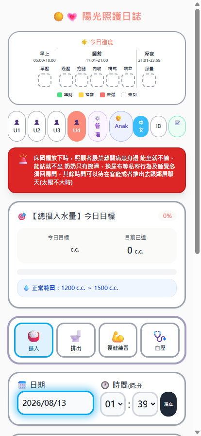
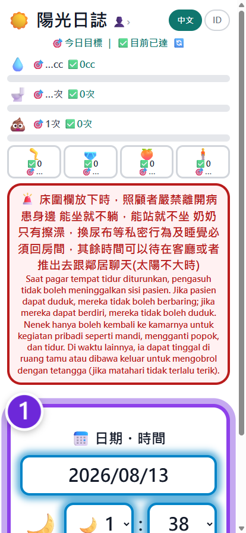
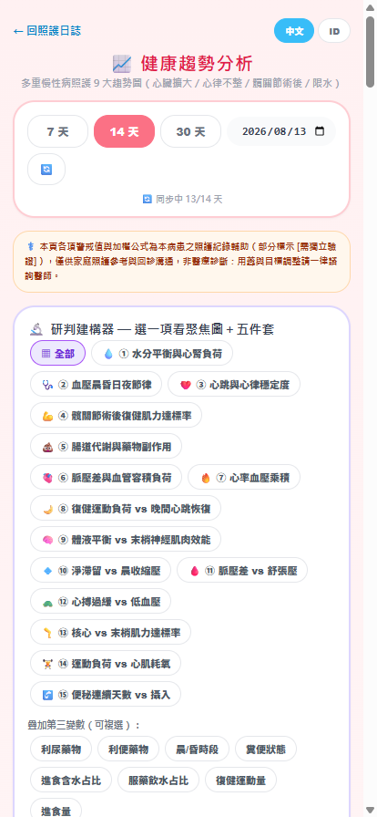

# 陽光照護日誌 / Sunshine Care Log
> A free, open-source daily care tracking tool for elderly patients — built for family caregivers.

---

## What is this?

A bilingual (Traditional Chinese 🇹🇼 / Indonesian 🇮🇩) web app designed to help **family caregivers** track daily health data for elderly patients at home — especially those with chron[...] 

No installation needed. Works on any smartphone browser. Data syncs to Google Sheets via Google Apps Script.

---

## Features

- **Fluid intake tracking** — water, medication drinks, nutritional supplements, meals (with daily target & progress bar)
- **Fluid output tracking** — urine volume + color, bowel movements with status
- **Intelligent urine target algorithm** — auto-calculates expected urine output based on water intake goal, adjusted for diuretic medication (×1.1–1.5 range) vs. no medication (×0.4–0.6 r[...]
- **Fluid overload warning** — red alert when total intake exceeds 1,200 c.c.
- **Exercise logging** — bottle lifts, foot presses, knee bends, standing assistance (with safety protocol checklist)
- **Blood pressure & heart rate** — morning and evening measurements with measurement guidelines
- **Constipation alert system** — auto-triggers warning every 2 hours between 60–72 hours after last bowel movement, with bilingual safety instructions prohibiting unsupervised enema use
- **Medication state tracking** — diuretics and laxatives, persisted to cloud
- **Time-based reminder system** — smart reminders for BP measurement, exercise slots, and bedtime urine check
- **Cloud sync** — all data saved to Google Sheets via Google Apps Script; supports multi-caregiver households
- **Optimistic UI** — records appear instantly without waiting for server response
- **Weekly cleaning reminders** — built-in schedule for household hygiene tasks

---

## Who is this for?

- Family members caring for elderly parents or grandparents at home
- Households with multiple rotating caregivers (especially across language barriers)
- Patients with conditions requiring strict fluid monitoring (heart failure, dialysis, post-surgery recovery)

---

## Tech Stack

| Layer | Technology |
|-------|-----------|
| Frontend | Vanilla HTML + JavaScript + Tailwind CSS |
| Backend | Google Apps Script (serverless) |
| Database | Google Sheets |
| Hosting | GitHub Pages (free) |

No frameworks. No build tools. No dependencies to install. Opens directly in any browser.

---

## Setup / Self-Hosting

1. Fork this repository
2. Deploy your own Google Apps Script backend (see `GAS_URL` in `index.html`)
3. Create a Google Sheet for data storage
4. Update `GAS_URL` and `SPREADSHEET_URL` constants in `index.html`
5. Enable GitHub Pages on your fork → done

---

## Screenshots

| Daily tracking | Bilingual guided entry | Trend analysis |
|---|---|---|
|  |  |  |
| Progress strip, fluid target and category logging | Every string in zh-TW and Indonesian, step by step | 15 cross-variable charts over 7/14/30 days |

*(Live demo: https://anwer3712.github.io/diet-log/ — screenshots taken on a 414×896 phone viewport)*

---

## Motivation

Built out of necessity. When a family member required 24/7 home care with strict fluid management, existing apps were either too complex, English-only, or required monthly subscriptions. This tool[...]

---

## Roadmap

Planned improvements — each one is an open issue, community input welcome:

- [ ] [#15](https://github.com/anwer3712/diet-log/issues/15) **AI-assisted health analysis** — integrate Claude to detect abnormal trends across fluid intake, urine output, and blood pressure data, and translate raw numbers into plain-language guida[...]
- [ ] [#16](https://github.com/anwer3712/diet-log/issues/16) **AI caregiver Q&A** — let caregivers ask questions in their own language ("her urine was dark today, should I worry?") grounded in the patient's actual logged data
- [ ] [#17](https://github.com/anwer3712/diet-log/issues/17) **Additional language pairs** — English, Vietnamese, Tagalog, Thai for multicultural caregiving households
- [ ] [#18](https://github.com/anwer3712/diet-log/issues/18) **Offline mode** — service worker caching for unstable connections
- [ ] [#19](https://github.com/anwer3712/diet-log/issues/19) **Printable weekly reports** — one-page summaries for doctor visits
- [ ] [#20](https://github.com/anwer3712/diet-log/issues/20) **Multi-patient support** — for households or small care facilities tracking more than one person

---

## Contributing

Pull requests welcome — see [CONTRIBUTING.md](CONTRIBUTING.md) for how to help (translations especially appreciated). This project follows a [Code of Conduct](CODE_OF_CONDUCT.md).

If you care for an elderly family member and need a feature — [open an issue](https://github.com/anwer3712/diet-log/issues).

---

## Security

Found a vulnerability? Please report it privately — see [SECURITY.md](SECURITY.md).
Do not open a public issue, and never include real patient data in a report.

---

## License

MIT © 2026 anwer3712
